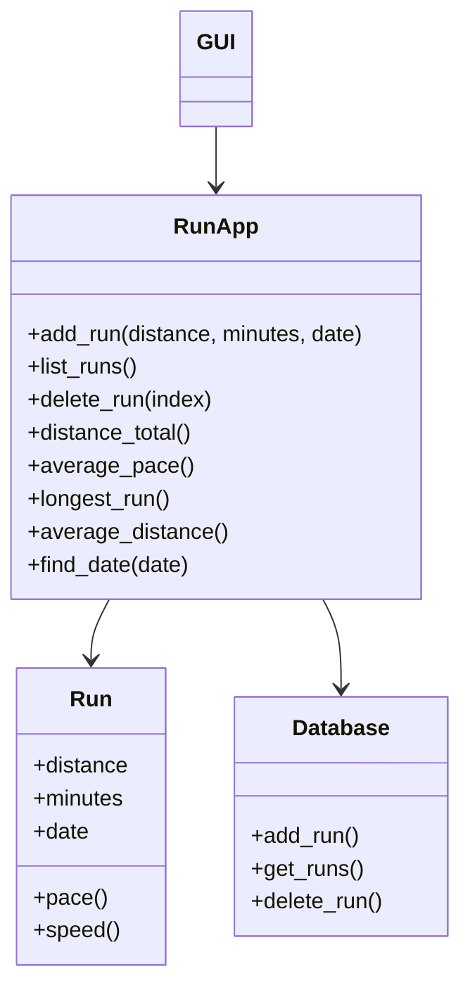

# Arkkitehtuuri

# Sovelluksen rakenne

Sovellus on jaettu kolmeen pääosaan: käyttöliittymään, sovelluslogiikkaan ja tietojen tallennukseen

# Käyttöliittymä GUI

Käyttöliittymä on toteutettu Tkinterillä ja se vastaa käyttäjän syötteiden vastaanottamisesta ja tulosten näyttämisestä.

Käyttäjä voi käyttöliittymän kautta:

- lisätä juoksusuorituksia
- poistaa juoksusuorituksia
- tarkastella tilastoja
- hakea suorituksia päivämäärän perusteella

Käyttöliittymä ei sisällä sovelluslogiikkaa, vaan kutsuu RunApp luokasta metodeja.

# Sovelluslogiikka RunAPP

RunApp sisältää kaiken logiikan, joka liittyy juoksusuoritusten käsittelyyn.

- vastaanottaa pyynnöt käyttöliittymältä
- käsittelee dataa
- kutsut tietokannasta

Sisältää seuraavat toiminnot

- Suoritusten lisääminen ja poistaminen
- Kokonaismatkan laskeminen
- Keskimääräisen vauhdin laskeminen
- Pisimmän ja nopeimman suorituksen etsiminen
- Hakeminen päivämäärän perusteella

# Run luokka

Run luokka kuvaa yksittäistä juoksusuoritusta

Sisältää seuraavat toiminnot

- Matka
- Aika
- Päivämäärä

Sisältää metodit

- Vauhdin laskeminen (pace)
- Nopeuden laskeminen (speed)

# Tietokanta (database)

Tietojen pysyväistallennus on toteutettu tietokannalla SQLite.

Tietokantakerros:

- Tallentaa juoksusuoritukset
- Hakee suorituksia
- Poistaa suorituksia

Tietokantaan tallennetaan jokaiselle suoritukselle:

- Id
- Distance
- Minutes
- Date