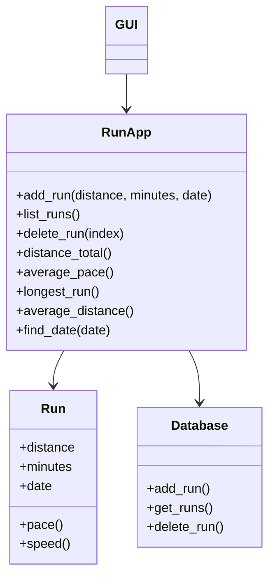

# Arkkitehtuuri

```mermaid
classDiagram

class GUI {
}


class RunApp {
    +add_run(distance, minutes, date)
    +list_runs()
    +delete_run(index)
    +distance_total()
    +average_pace()
    +longest_run()
    +average_distance()
    +find_date(date)
}

class Run {
    +distance
    +minutes
    +date
    +pace()
    +speed()
}

class Database {
    +add_run()
    +get_runs()
    +delete_run()
}

GUI --> RunApp
RunApp --> Run
RunApp --> Database
```