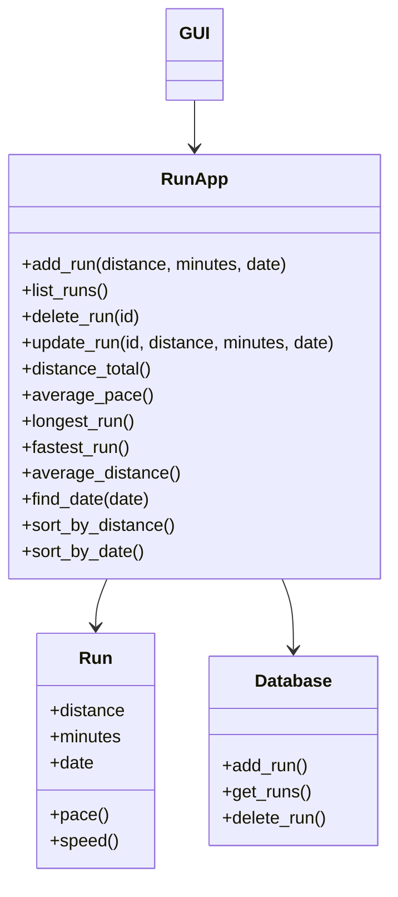
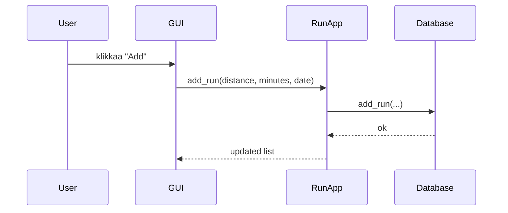
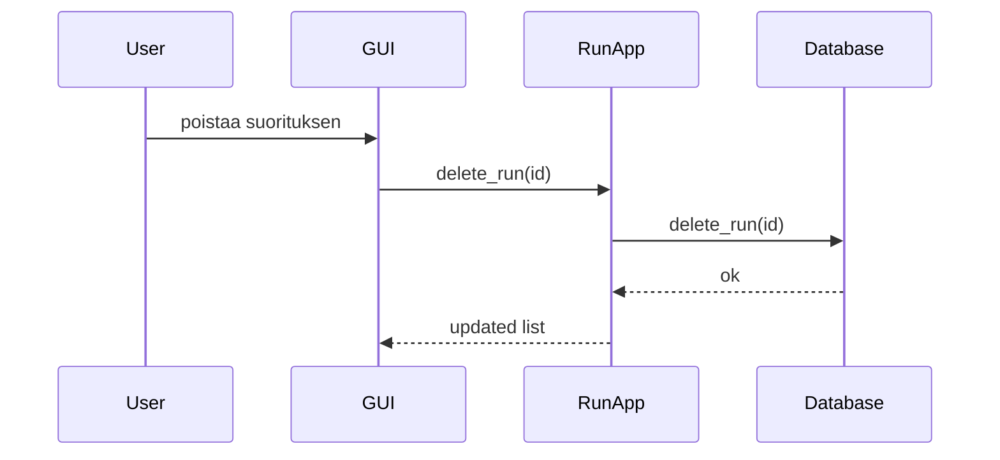

# Arkkitehtuuri

---

## Sovelluksen rakenne

Sovellus on jaettu kolmeen pääosaan: käyttöliittymään, sovelluslogiikkaan ja tietojen tallennukseen
---

## Pakkausrakenne

Sovelluksen koodi on jaettu loogisiin osiin:

- `gui.py`: käyttöliittymä
- `run.py`: sovelluslogiikka (RunApp)
- `database`: tietokantatoiminnot
- `graphs.py`: graafien piirtäminen

Rakenne noudattaa arkkitehtuuria, jossa käyttöliittymä riippuu sovelluslogiikasta ja sovelluslogiikka riippuu tietokannasta.
---

## Käyttöliittymä GUI

Käyttöliittymä on toteutettu Tkinterillä ja se vastaa käyttäjän syötteiden vastaanottamisesta ja tulosten näyttämisestä. RunApp tarjoaa käyttöliittymälle kaikki sovelluksen toiminnot.

Käyttäjä voi käyttöliittymän kautta:

- lisätä juoksusuorituksia
- poistaa juoksusuorituksia
- tarkastella tilastoja
- hakea suorituksia päivämäärän perusteella

---
- Käyttöliittymä ei sisällä sovelluslogiikkaa, vaan kutsuu RunApp luokasta metodeja.
---

## Sovelluslogiikka RunApp

RunApp sisältää kaiken logiikan, joka liittyy juoksusuoritusten käsittelyyn.

- vastaanottaa pyynnöt käyttöliittymältä
- käsittelee dataa
- kutsut tietokannasta

Sisältää seuraavat toiminnot

- Suoritusten lisääminen ja poistaminen
- Kokonaismatkan laskeminen
- Keskimääräisen vauhdin laskeminen
- Pisimmän ja nopeimman suorituksen etsiminen
- Hakeminen päivämäärän perusteella
---

## Run luokka

Run luokka kuvaa yksittäistä juoksusuoritusta

Sisältää seuraavat toiminnot

- Matka
- Aika
- Päivämäärä

Sisältää metodit

- Vauhdin laskeminen (pace)
- Nopeuden laskeminen (speed)
---

## Tietokanta (database)

Tietojen pysyväistallennus on toteutettu tietokannalla SQLite.

Tietokantakerros:

- Tallentaa juoksusuoritukset
- Hakee suorituksia
- Poistaa suorituksia

Tietokantaan tallennetaan jokaiselle suoritukselle:

- Id
- Distance
- Minutes
- Date

---

## Sovelluksen toiminnallisuutta kuvaava sekvenssikaavio, joka esittää juoksusuorituksen lisäämisen.

---
- Kaavio kuvaa, miten käyttäjän lisäämä suoritus kulkee käyttöliittymästä sovelluslogiikan kautta tietokantaan ja päivitetty tieto palautetaan takaisin käyttöliittymälle.
---

## Sovelluksen toiminnallisuutta kuvaava sekvenssikaavio, joka esittää juoksusuorituksen poistamisen

---
- Kaavio kuvaa, miten valittu suoritus poistetaan tietokannasta sovelluslogiikan kautta jonka jälkeen käyttöliittymä päivitetään vastaamaan muutosta.
---

## Ohjelman rakenteeseen jääneet heikkoudet: